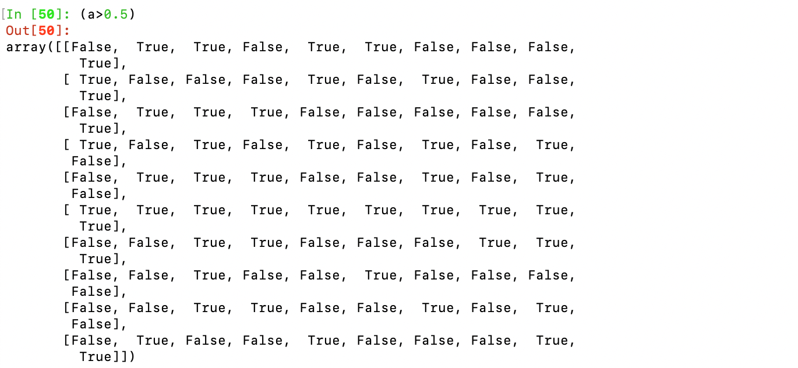
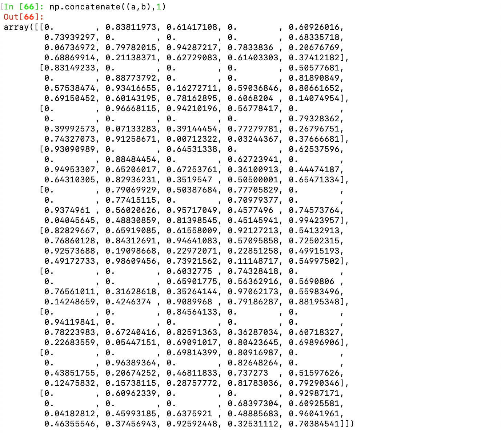
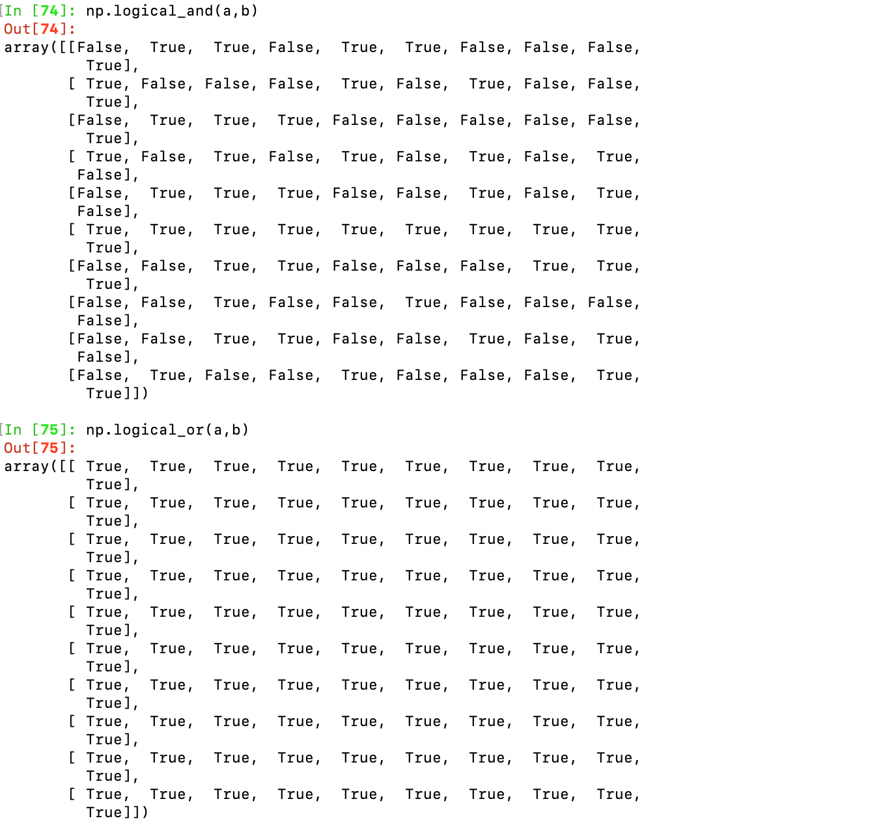

# Assignment 0 Report by Junchen He

## Task 1 conda info


## Task 2 Run all of Python commands in the table "Linear Algebra Equivalents"











## Task 3


## Task 4

```python
import numpy as np
import matplotlib.pyplot as plt

x = np.linspace(0, 10, 100)
y1 = np.sin(x)
y2 = np.cos(x)

plt.figure(figsize=(8, 6))
plt.plot(x, y1, label='sin(x)', color='blue', linestyle='-', linewidth=2)
plt.plot(x, y2, label='cos(x)', color='red', linestyle='--', linewidth=2)

plt.title('Sine and Cosine Waves')
plt.xlabel('x')
plt.ylabel('y')

plt.show()
```


## Task 5

Github Account: orange0214

https://github.com/orange0214


## Task 6

https://github.com/orange0214/576NewProject


